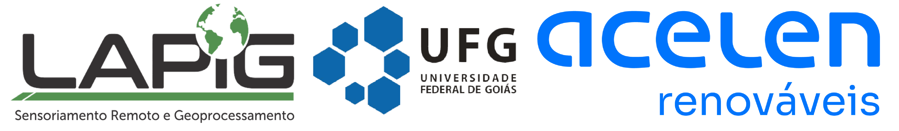

# Toolkit - Análise Temporal da Dinâmica da Cobertura e Uso do Solo 

## Sobre
Este repositório organiza os códigos do toolkit "Análise Temporal da Dinâmica da Cobertura e Uso da Terra", desenvolvido pelo [Laboratório de Processamento de Imagens e Geoprocessamento (LAPIG/UFG)](https://lapig.iesa.ufg.br/). O toolkit tem como objetivos principais analisar a dinâmica e cobertura do uso da terra, realizar mapeamentos em escala detalhada, e determinar o nível de vigor e a produtividade primária bruta das pastagens no Brasil.

**Requisito**:

* Acesso à Internet

* Conta do Google (gmail)
  
* Navegador compatível ao Google Earth Engine
  
* Cadastro no Google Earth Engine

## Histórico de versões

* v 1.0
    * Upload de dados externos via asset do Google Earth Engine. 
    * Cobertura e uso da terra, e nivel de vigor da pastagem com pixel de 30m entre 1985 à 2023.
    * Dinâmica do uso da terra e a taxa de conversão da área natural para antrópica.

* v 2.0
    * Mapeamento à nível de propriedade com dados Sentinel-2 e Embeddings. 
    * Cálculo da perda média anual do solo (RUSLE).
    * Dados de vigor para os estados de Minas Gerais e Bahia.

* v 3.0
    * Análise de tendência das áreas de pastagens usando dados de NDVI em série temporal. 
    * Adição de novas bacias hidrográficas no cálculo da RUSLE.
    * Ferramenta de download das camadas para o google drive.

* v 4.0
    * Análise de tendência das áreas de pastagens usando dados de Produtivade Primária Bruta (GPP) bimestral em série temporal. 
    * Atualização da interface gráfica.    
  
