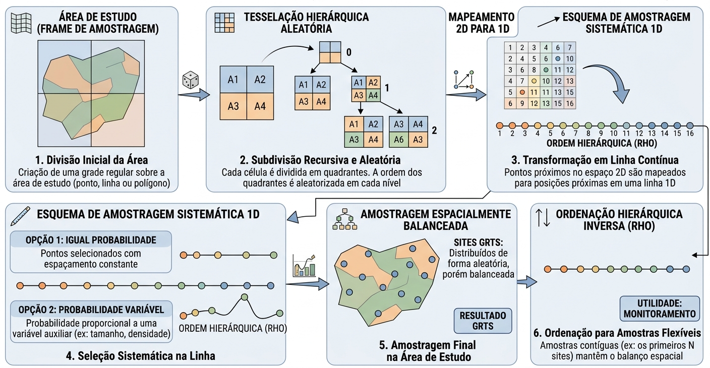

# 2. BASE TEÓRICA DO ALGORITMO

As metodologias empregadas são baseadas em princípios de sensoriamento remoto, inteligência artificial, modelo linear e análise de séries temporais, incluindo: Uso de imagens de satélites com diferentes resoluções espaciais, uso de técnicas de aprendizagem de máquina e aprendizado profundo (DeepLearning) para classificação automática, aplicação de modelos lineares no cálculo da perda média do solo, cálculo de índices de vegetação e produtividade, e análises de tendência.

## 2.1 - Dados satelitários

Os dados de sensoriamento remoto a serem utilizados neste projeto incluem tanto imagens públicas e gratuitas, a exemplo daquelas adquiridas pelos sensores a bordo dos satélites Landsat e Sentinel, bem como imagens comerciais (ex. Planet Scope). No caso das imagens Landsat, estas serão obtidas dos satélites Landsat 5, 8 e 9, com resoluções espaciais de 30 metros, e resoluções espectrais de 8 e 11 bandas espectrais, respectivamente. A resolução espacial é a capacidade que o sensor a bordo de um satélite tem de detectar e separar um alvo de interesse na superfície terrestre; já a resolução espectral diz respeito à quantidade de “canais” (bandas) que o sensor tem para diferenciar, espectralmente, objetos na superfície terrestre. Os satélites da série Landsat fornecem informações sistemáticas desde 1985, sendo os seus dados ideais para análises baseadas em séries históricas, com vistas a se entender a dinâmica do uso e cobertura da terra em uma determinada região.

Em relação aos satélites Sentinel-2 (a, b, e c), estes oferecem uma resolução espacial máxima de 10 metros, permitindo um mapeamento significativamente mais detalhado (~ 0.1 hectare). Com suas 12 bandas de resolução espectral, o Sentinel-2 consegue diferenciar objetos com maior precisão em comparação aos sensores da série Landsat; contudo, os seus dados estão disponíveis apenas a partir de 2016, o que limita a análise de séries históricas mais longas.

Mais recentemente, com o avanço da Inteligência Artificial e tecnologias e desenvolvimentos associados, novas maneiras de acessar dados e informações de sensoriamento remoto, a exemplo dos Embeddings, se tornaram possíveis. Os Embeddings são uma forma de representação espaço-temporal altamente precisa e compacta, utilizada para mapear e monitorar objetos na superfície terrestre. Em essência, os embeddings são vetores que resumem grandes quantidades de informações geográficas complexas, incluindo dados de satélites (como o Sentinel-2), textos, vídeos e etc. Essa capacidade de integração de dados tem o potencial de tornar os mapeamentos baseados em embeddings mais eficientes e precisos (Brown et al., 2025).

As principais características dos embeddings são:

- Assimilação de contexto: Esse dados são capazes de avaliar a similaridade entre pixels a partir do seu contexto (vizinhança) no espaço e no tempo;
- Universalidade: Os embeddings são desenvolvidos com o objetivo de resolver problemas de mapeamento global, gerando um espaço de características gerais e universais;
- Sumarização compacta dos dados: Atuam como síntese temporal, descrevendo de forma compacta as propriedades da superfície terrestre e encapsulando informações que representam a trajetória temporal das variáveis (dados utilizados).

Especificamente, para a produção dos Alpha Earth Embeddings, a Google Deepmind utilizou diversas fontes para o treinamento do respectivo foundation model, com destaque para:

- Imagens dos satélites: das séries Landsat (8 e 9) e Sentinel (1 e 2);
- Dados geoespaciais: Dados de altimetria, climáticos, campo gravitacional, cobertura e uso da terra;
- Outras informações auxiliares: textos da Wikipedia e bases relacionadas à biodiversidade.

Estes embeddings anuais, disponibilizados a partir do ano 2017 por meio da plataforma Google Earth Engine, são compostos por 64 dimensões (bandas) com uma resolução espacial de 10 metros.

## 2.2 - Plataforma Google Earth Engine

O Google Earth Engine é uma plataforma para o processamento de dados geoespaciais em nuvem, em escala planetária, a qual traz enormes recursos computacionais da Google para lidar com uma variedade de questões de alto impacto, incluindo desmatamento, monitoramento climático e proteção ambiental. O catálogo de dados no Google Earth Engine abriga um grande repositório de dados geoespaciais que são disponíveis publicamente, incluindo, imagens de satélite, dados meteorológicos e climáticos, mapeamentos da cobertura e uso da terra (local e global), dados topográficos e socioeconômicos, que podem ser acessados de forma pública e gratuita (Gorelick et al., 2017).

Nesta plataforma, os usuários podem utilizar funções que vão desde a matemática simples até níveis avançados de classificação de imagens por meio de algoritmos de aprendizagem de máquina (Amani, 2020).

No trabalho de Souza et al. (2020) foi descrito uma nova abordagem de mapeamento anual da cobertura e uso da terra, a partir de 1985, para o Brasil, com base no algoritmo Random Forest aplicado às imagens da série Landsat usando a plataforma Google Earth Engine. Esta abordagem é a base da iniciativa MapBiomas, já em sua Coleção 10 de mapas.

Para acessar a plataforma do Google Earth Engine, basta ter uma conta do Google (Gmail), e fazer o registro disponível no link: <https://earthengine.google.com/>.

## 2.3 - Classificação do Uso e Cobertura da Terra

As classificações de cobertura e uso da terra são geradas a partir de dados de sensoriamento remoto, por exemplo, satélites Landsat 5, 7 e 8, onde cada informação associada a cada elemento de imagem (pixel) é fundamentada no comportamento espectral dos diferentes alvos terrestres (vegetação, pastagem, água, etc). Este comportamento, relacionado a capacidade de cada objeto na superfície em absorver e/ou refletir a radiação eletromagnética em seus vários comprimentos de onda e que varia sazonalmente, é base para a discriminação e classificação de objetos em qualquer algoritmo.

Em geral, para a classificação dos tipos de uso e cobertura da terra se utiliza algoritmos baseados em técnicas de aprendizado de máquina, aplicadas pixel a pixel, onde o algoritmo identifica padrões específicos, conforme os tipos de cobertura da Terra, através das diferenças espectrais (e temporais) associadas a cada objeto (i.e. classe de cobertura e/ou uso).

De acordo com Mitchell (1997), a aprendizagem de máquina está relacionada à construção de soluções computacionais que melhoram suas percepções automaticamente com a experiência (amostras). Isso significa que, ao inserir novos dados, esses sistemas computacionais são treinados para melhorar seu desempenho e precisão preditiva.

Conforme MapBiomas (2024), os mapas de cobertura e uso da terra disponíveis na plataforma do MapBiomas são elaborados da seguinte forma:

- **Mosaico Anual - Landsat:** Para cada ano, todas as imagens landsat são selecionadas para o cálculo de índices espectrais e frações espectrais. Em seguida, são calculados as médias, máximos, mínimos, amplitude para cada pixel da imagem, resultando em 105 imagens no ano. Esse processo é repetido anualmente; se o período de tempo for de 1985 à 2024, essa operação será repetida 40 vezes.

- **Aplicação do Modelo de Aprendizagem de Máquina:** Após a geração dos mosaicos anuais, o algoritmo Random Forest (Breiman, 2001) é aplicado no processo de classificação, usando a infraestrutura de nuvem da Google. O algoritmo emprega amostras inspecionadas visualmente a partir das imagens de satélite para seu treinamento e teste. Nesta etapa, é realizada a análise da acurácia do algoritmo e, se a precisão for satisfatória, a classificação das imagens é executada.

- **Pós-processamento:** Esta etapa consiste na aplicação de filtros para remover ruídos gerados pela classificação das imagens durante o mapeamento da cobertura e uso do solo. O primeiro filtro aplicado é o espacial, que visa manter a consistência dos dados espaciais, eliminando pixels classificados de forma isolada ou em bordas de transição entre classes. Em seguida, para garantir a consistência temporal e reduzir mudanças de uso e cobertura que sejam impossíveis ou não permitidas (por exemplo, transições abruptas de "Floresta Natural" para "Não Floresta" e novamente para "Floresta Natural"), são aplicados filtros de consistência temporal.

- A validação do resultado final dos mapas gerados automáticamente é feita por meio da análise de acurácia, com base em pontos amostrais obtidos via interpretação visual das imagens utilizadas no processo de classificação.

## 2.4 - Vigor da Pastagem

O vigor da pastagem é uma medida que reflete o desenvolvimento da planta forrageira, auxiliando na avaliação da produtividade ou estágio de degradação das pastagens (Santos et al., 2022; Ferreira Jr et al., 2023). Sua medição é feita a partir de imagens do sensor MODIS a bordo do satélite Terra, com dados disponíveis desde o ano 2000.

Inicialmente os dados do índice de vegetação EVI passam por um preenchimento de dados faltantes (lacunas) ocasionado pela contaminação de nuvens e/ou sombras, através de um algoritmo de preenchimento dessas lacunas (i.e. gap filling). Em seguida é feito um ajuste sazonal (dessazonalização), removendo os efeitos sazonais dos valores das séries temporais, para evitar distorções na análise. Após a dessazonalização, são gerados imagens medianas anuais do conjunto de dados, cobrindo um período de 2000 à 2024. A mediana foi escolhida por ser uma medida estatística que minimiza a influência de valores anômalos (outliers) na análise.

A análise envolve a extração de pixels de EVI medianos anuais em áreas identificadas como pastagem nos mapas, os quais são submetidos à um filtro temporal mediano (5 anos), seguida de uma normalização. O processo de normalização consiste no cálculo dos valores de EVI máximo e mínimo, onde o valor máximo é a média do 1% dos valores mais altos de EVI e o valor mínimo, a média do 1% dos valores mais baixos de EVI, conforme a equação 01. O resultado da equação corresponde a valores entre 0 e 1.

$$
EVI{norm} = \frac{EVI{i}  - EVI{min}}{EVI{min}  - EVI{max}} \tag{Eq. 01}                                                        
$$

Onde:
<small>

* $EVI{\text{norm}}$: Valor do EVI normalizado entre 0 e 1

* $EVI{\text{i}}$: Valor do EVI da série temporal.

* $EVI{\text{min}}$: Valor médio de 1% dos máximos de todos os valores de EVI na série temporal.

* $EVI{\text{max}}$: Valor médio de 1% dos mínimos de todos os valores de EVI na série temporal.

</small>

Às imagens normalizadas são estratificadas em três níveis de vigor:

- Baixo Vigor: menor que 0,4;
- Médio Vigor: maior que 0,4 e menor que 0,6; e
- Alto Vigor: maior que 0,6

Todo o processo de geração de dados de vigor é feito em regiões com características ambientais similares.

## 2.5 - Produtividade Primária Bruta ( Gross Primary Productivity - GPP)

Conforme Aragão (2004), a Produtividade Primária Bruta (GPP) quantifica o C atmosférico convertido em matéria orgânica via fotossíntese. Isso nos permite não só verificar a quantidade de C fixado pelas pastagens, conforme diferentes níveis de vigor, mas também identificar ganhos e perdas de produtividade ao longo do tempo.

Os valores de GPP (Produtividade Primária Bruta) podem ser determinados pelo modelo que considera a Eficiência do Uso de Luz Absorvida (LUE - Light Use Efficiency), no qual a quantidade de energia absorvida da radiação solar visível disponível pelas plantas determina o carbono fixado por meio das atividades fotossintéticas (Monteith, 1972; Veloso, 2018; Su et al., 2022). Essencialmente, o cálculo do GPP é aplicado conforme a equação 02.

$$
GPP = PAR \times fAPAR \times LUE_{max} \tag{Eq. 02}                                                        
$$

Onde:
<small>

* $PAR$: Radiação fotossinteticamente

* $fPAR$: Fração da radiação fotossinteticamente

* $LUEmax$: Eficiência da Luz

</small>

Isik et al., 2024, no âmbito da iniciativa Global Pasture Watch, produziram um conjunto de dados de GPP com a resolução espacial de 30 metros bimestral nas áreas de pastagem globais no período de 2000 a 2024. Para calcular o GPP bimestral, foram utilizados um repositório Landsat reconstruído e disponível bimestralmente (Consoli et al.,2024), combinado com dados de temperatura do MODIS com 1 Km de resolução espacial e a Radiação Fotossinteticamente Ativa (PAR) do sensor CERES (a bordo da plataforma Terra), com resolução espacial aproximada de 100 km.

Neste projeto, teremos por referência as estratégias adotadas por Isik et al.(2024). Contudo, essas estratégias também serão adaptadas para os Landsat; da mesma forma, utilizaremos valores de LUE mais próximos à realidade das regiões de interesse.

## 2.6 - Equação Revisada Universal de Perda do Solo (RUSLE)

A Equação Universal de Perda do Solo Revisada (RUSLE) é um modelo matemático desenvolvido pelo Departamento da Agricultura dos Estados Unidos (USDA), com o intuito de estimar a erosão laminar do solo a partir de fatores como erodibilidade (precipitação), erosividade do solo, declividade, cobertura da terra e práticas de controle da erosão (Alebachew et. al, 2025). A implementação da RUSLE em ambiente cloud (processamento na nuvem), como o Google Earth Engine, utiliza dados de satélites de diversas resoluções espaciais para o cálculo preciso de seus fatores, por exemplo: CHIRPS (para Precipitação), Textura do Solo (Tomislav, 2018), Altimetria e Declividade (SRTM), e o índice de vegetação (NDVI) calculado a partir do do sensor OLI a bordo do satélite Landsat 8, com resoluções espaciais de 5.566, 250 e 30 metros, respectivamente.

Este modelo é uma versão revisada da USLE (Universal Soil Losses Equation) por Renard et. al (1997), descrita conforme a equação 03.

$$
A = R \times K \times LS \times C \times P \tag{Eq. 03}                                                        
$$

Onde:
<small>

* $A$: Perda média anual do solo.

* $R$: Fração da radiação fotossinteticamente.

* $K$: Fator de Erodibilidade, que quantifica o potencial de desprendimento de sedimentos causado pela chuva (CHIRPS) e pelo escoamento superficial.

* $LS$: Fator topográfico, que mede o impacto da inclinação e do comprimento da encosta na velocidade do escoamento superficial, a partir dos dados do SRTM.

* $C$: Fator de Manejo do Solo, que considera a influência da cobertura vegetal, por meio do NDVI.

* $P$: Eficiência da Luz.

</small>

Conforme Barbosa (2024), os cinco fatores da RUSLE são utilizados para determinar o potencial de erosão do solo, sendo que:

- Os fatores R, K e LS avaliam o potencial natural de erosão;
- Já os fatores C e P determinam a influência de ações antrópicas (ou seja, humanas) na erosão do solo.

A Rusle é aplicada em uma bacia hidrográfica, a qual, conforme a Política Nacional de Recursos Hídricos (Lei 9.433, de 08 de janeiro de 1997), é unidade territorial para o gerenciamento dos recursos hídricos, sendo que a água drenada nessas bacias deve ser gerenciada como um patrimônio público finito e com valor econômico.

A divisão do território brasileiro em bacias hidrográficas evoluiu com as crescentes necessidades de gestão da água. Em 1972, o Departamento Nacional de Águas e Energia Elétrica (DNAEE) estabeleceu a primeira proposta de divisão hidrográfica usando o método hierárquico de Otto Pfafstetter (baseado em áreas de drenagem) para otimizar a oferta e o processamento de dados. Já em 2003, conforme a resolução Federal nº32 do Conselho Nacional de Recursos Hídricos instituiu a Divisão Hidrográfica Nacional (DHN), com o objetivo de organizar o país em grandes 12 regiões hidrográficas. Essa divisão foi definida com base nos limites naturais das bacias e na semelhança das características ambientais, sociais e econômicas dos territórios vizinhos.

O cálculo da RUSLE no toolkit é aplicado nos níveis 1 à 3 da divisão do DHN e níveis 1 e 2 do DNAEE, onde os níveis 1 das bacias são mais amplas (generalizadas), enquanto os níveis 2 e 3 possuem um detalhamento maior.

## 2.7 - Análise de Tendência em Sensoriamento Remoto

O uso de imagens de satélites em séries temporais na medição de vigor e produtividade das pastagens estão correlacionados às metodologias da análise de tendência e/ou detecção de mudança do uso e cobertura da terra, que auxiliam na compreensão do seu processo de degradação (Souza, 2017). No estudo de Andrade (2014), foram identificadas áreas de pastagens potencialmente em processo de degradação, por meio dos valores (magnitude) da tendência da regressão linear (slope) ajustada, pixel a pixel, às imagens do sensor Terra MODIS.

O propósito de analisar tendências em séries temporais de imagens de satélite é importante para várias aplicações em larga escala e de longo prazo; por isso, é necessária a harmonização e o preenchimento de lacunas (buracos) nas imagens, causados por contaminação de nuvens e/ou sombras no pixel, a fim de garantir consistência espacial e ao longo do tempo na série temporal das imagens de satélite.

A Mediana Temporal de Janela móvel (Temporal Moving Window Median) é um método personalizado de preenchimento de lacunas (gap-filling) que foi desenvolvido e implementado para preencher valores ausentes (NoData). O algoritmo é projetado para ser computacionalmente rápido e adequado para preencher dados destinados ao mapeamento anuais em escala continental e multidecenal. Este método foi utilizado no contexto da criação do EcoDataCube para imputar dados ausentes na série temporal do Landsat (2000–2020), especificamente nos agregados trimestrais (Witjes,2023) .

A principal diferenciação do TMWM de outros modelos de gapfiling é que ele utiliza apenas valores existentes no conjunto de dados, como medianas de pixels vizinhos temporais. Isso garante que os valores imputados permaneçam no mesmo espaço de características no qual os modelos subsequentes de aprendizado de máquina serão treinados.

O TMWM tenta derivar um valor para pixels ausentes em três fases sequenciais. Em cada fase, o algoritmo segue uma lógica de expansão da janela de busca.

- **Mediana do mesmo período em diferentes anos:** O algoritmo tenta primeiro calcular a mediana do mesmo período (por exemplo, trimestre) nos anos adjacentes (anterior e/ou seguinte). Se não houver valores no ano anterior ou seguinte, a janela de busca se expande para incluir valores desse período em anos progressivamente anteriores e posteriores.

- **Média das medianas de períodos adjacentes:** caso a fase 1 falhar, o TMWM deriva o valor a partir de uma média das medianas do período anterior e seguinte do mesmo ano. Caso necessário, a janela de busca se expande novamente para incluir esses períodos anterior e seguinte em anos progressivamente adjacentes.

- **Mediana de todos os períodos:** se as fases anteriores falharem, a janela de busca abrange todos os valores em toda série temporal do pixel, e o valor imputado é a mediana desses valores.

Na opção de Análise de tendência das pastagem do toolkit, é feita a exclusão dos pixels contaminados por nuvens e/ou sombra utilizando a banda de qualidade, do satélite, seja Landsat ou Sentinel, e após a exclusão dos pixels contaminado, esse são preenchidos usando o Método TMWM (implementado no Google Earth Engine) e depois é calculado o coeficiente angular nas áreas de pastagem da propriedade inserida pelo usuário, no qual informa magnitude e a direção da mudança que ocorre ao longo do tempo. Quando o valor do coeficiente angular é positivo, indica uma tendência positiva, ou seja, um aumento no vigor ou na produtividade das pastagens, e os valores negativos, sugere que há um processo de queda do vigor da pastagem.

## 2.8 - Integração de Dados Fundiários

As seções anteriores tratam de grandezas medidas sobre a superfície: cobertura, vigor, produtividade, perda de solo. Nenhuma delas, isoladamente, responde à pergunta que o projeto precisa responder — *de quem é a área e qual a sua condição*. Para isso é necessário um recorte territorial que delimite a **propriedade rural**, que é a unidade de decisão do produtor, a unidade de contrato e, como se verá nas Seções 2.9 a 2.14, também a unidade primária de amostragem. O dado fundiário é, portanto, insumo tão estruturante quanto a imagem de satélite.

O problema é que essa delimitação não existe pronta. O Brasil não dispõe de um cadastro fundiário único: a informação está distribuída por dezenas de bases mantidas por instituições distintas — INCRA, FUNAI, Ministério do Meio Ambiente, Serviço Florestal Brasileiro, órgãos estaduais de terras, ANA e IBGE —, com escalas, datas de referência, critérios de validação e regimes jurídicos heterogêneos. Essas bases se sobrepõem, apresentam vazios e não raro se contradizem. Construir um recorte fundiário utilizável exige, por isso, um procedimento explícito de integração.

### 2.8.1 - Hierarquia de prevalência entre bases

Reconhecida a heterogeneidade das fontes, a integração se resume a uma decisão recorrente: quando duas camadas incidem sobre a mesma porção do território, qual prevalece? A resposta adotada pela literatura brasileira não é uma ordem de importância ambiental ou de mérito dos direitos envolvidos, e sim uma **ordem de confiabilidade da informação**, avaliada por quatro critérios (Freitas et al., 2018):

- **Segurança jurídica do direito** — grau de respaldo legal e reconhecimento formal da camada, considerando a legislação aplicável, os procedimentos de titulação e os antecedentes na resolução de conflitos;
- **Precisão da informação geoespacial** — qualidade do levantamento que originou a geometria, incluindo a exigência ou não de responsável técnico credenciado;
- **Possibilidade de receber sobreposição** — robustez da camada diante de conflitos espaciais recorrentes;
- **Possibilidade de mudança no domínio** — estabilidade da ocupação, isto é, quão provável é que a destinação atual venha a se alterar.

A hierarquia proposta por Freitas et al. (2018), construída em consulta a INCRA, Secretaria do Patrimônio da União e demais partes interessadas, ordena catorze bases segundo esses critérios, com os imóveis certificados SIGEF/SNCI privados na primeira posição e as florestas públicas do tipo B na última. Camadas que representam feições físicas do território — massas d'água e áreas urbanas — recebem prioridade máxima, por delimitarem porções cuja ocupação fundiária é impossível.

### 2.8.2 - Formalização por análise multicritério

A **Malha Fundiária Ambiental do LAPIG/UFG** (LAPIG, 2026) formaliza essa etapa pelo **método AHP** (*Analytic Hierarchy Process*), que converte julgamentos par a par em pesos numéricos e, mais importante, permite testar a coerência interna desses julgamentos.

Os quatro critérios são comparados dois a dois na escala de Saaty (Saaty, 1987), que varia de 1 — importância igual — a 9 — importância extrema —, com os valores pares reservados a situações de dúvida. Da normalização da matriz de comparação resultam os pesos de cada critério; na aplicação do LAPIG, 0,56 para segurança jurídica, 0,26 para precisão geométrica, 0,12 para sobreposição e 0,06 para estabilidade de domínio.

A propriedade que distingue o AHP de uma simples atribuição de pesos é a **verificação de consistência**. Se um avaliador julga o critério *A* mais importante que *B*, e *B* mais importante que *C*, seus julgamentos só são coerentes se atribuir a *A* importância proporcionalmente maior que a *C*. O grau de violação dessa transitividade é medido pelo índice de consistência, calculado a partir do maior autovalor \(\lambda_{\max}\) da matriz de comparação, para *n* critérios:

\[
IC = \frac{\lambda_{\max} - n}{n - 1} \tag{Eq. 04}
\]

O índice é então normalizado pelo índice randômico \(IR\), que é o valor esperado de \(IC\) para matrizes preenchidas aleatoriamente de mesma ordem, resultando na razão de consistência:

\[
RC = \frac{IC}{IR} \tag{Eq. 05}
\]

Onde:

<small>

* \(\lambda_{\max}\): maior autovalor da matriz de comparação par a par;
* \(n\): número de critérios comparados;
* \(IR\): índice randômico tabelado por Saaty em função de \(n\).

</small>

Adota-se \(RC < 0{,}10\) como limiar de aceitação: acima disso, os julgamentos são considerados inconsistentes e a matriz deve ser revista. Na aplicação do LAPIG, com quatro critérios, obteve-se \(RC = 4{,}61\%\), o que valida os pesos empregados na resolução das sobreposições.

### 2.8.3 - Integração de ativos ambientais

A etapa final da construção associa, à estrutura fundiária consolidada, os ativos ambientais que condicionam o uso possível de cada imóvel — Áreas de Preservação Permanente e Reserva Legal. Duas cautelas metodológicas se aplicam. A primeira é de fonte: a Reserva Legal só é extraível do CAR, por ser declarada em nível de imóvel, enquanto as APPs admitem derivação a partir de bases cartográficas independentes. A segunda é de **eliminação de dupla contagem**: havendo interseção entre APP e Reserva Legal, mantém-se a APP e remove-se o excedente da Reserva Legal, de modo que a mesma área não seja computada duas vezes no balanço de ativos e passivos ambientais.

O produto resultante associa, para cada porção do território, a categoria fundiária, a situação declaratória e os ativos ambientais incidentes — o que permite, no contexto deste projeto, distinguir a área total de uma propriedade daquela efetivamente disponível para uso produtivo. A aplicação desse recorte à definição do quadro amostral é descrita na Seção 3.2.2.

## 2.9 - Amostragem Estratificada Multivariada e Alocação Ótima de Neyman

Amostragem estratificada é particionar a população em subconjuntos — os estratos — internamente homogêneos quanto à variável de interesse, e sortear unidades dentro de cada um deles. O ganho é direto: alcançada a homogeneidade interna, a variância dentro de cada estrato é pequena e, como a variância do estimador global é uma composição das variâncias intraestrato, a precisão aumenta sem que a amostra precise crescer. A estratificação responde, assim, à decisão temática do desenho — quantas unidades observar e em que porções da população concentrá-las.

A estratificação é realizada por agrupamento numérico não supervisionado (K-Means), operando sobre as variáveis normalizadas (z-score) associadas a característica informativa do objeto de estudo. O **K-Means** é um algoritmo de agrupamento particional e não supervisionado — onde não há rótulo conhecido a ser reproduzido: a estrutura de grupos é inferida exclusivamente da geometria dos dados. Cada unidade é representada por um vetor \(\mathbf{x}\) em um espaço de *d* dimensões, uma por variável considerada, e o algoritmo distribui as *N* unidades em *k* grupos disjuntos \(C_1, \dots, C_k\), cada qual representado por um **centroide** \(\boldsymbol{\mu}_h\), que é o vetor médio das unidades do grupo. A partição buscada é a que minimiza a soma dos quadrados intragrupo (*within-cluster sum of squares*, WCSS), isto é, a dispersão total das unidades em torno dos centroides de seus respectivos grupos:

\[
\text{WCSS}(k) = \sum_{h=1}^{k} \sum_{\mathbf{x} \in C_h} \left\lVert \mathbf{x} - \boldsymbol{\mu}_h \right\rVert^2 \tag{Eq. 06}
\]

Onde:

<small>

* $\text{WCSS}(k)$: Soma dos Quadrados Dentro dos Clusters (da sigla em inglês Within-Cluster Sum of Squares), calculada em função do número total de grupos $k$.

* $k$: Número total de clusters (ou estratos/grupos) nos quais os dados foram divididos.

* $h$: Índice do cluster atual, que varia de 1 até $k$.

* $C_h$: O conjunto de dados/pontos pertencentes ao $h$-ésimo cluster.

* $\mathbf{x}$: Um vetor de dados (ou ponto individual) que pertence ao grupo $C_h$ (indicado por $\mathbf{x} \in C_h$ no segundo somatório).

* $\boldsymbol{\mu}_h$: O centroide (ou ponto médio/média vetorial) de todos os dados do cluster $C_h$.

* $\Vert{}\mathbf{x} - \boldsymbol{\mu}_h\Vert{}^2$: A distância euclidiana ao quadrado entre o ponto $\mathbf{x}$ e o centroide $\boldsymbol{\mu}_h$ do seu respectivo grupo.

</small>

O funcionamento é iterativo: fixado *k*, escolhem-se *k* centroides iniciais; na etapa de **atribuição**, cada unidade é associada ao centroide de que está mais próxima; na etapa de **atualização**, cada centroide é recalculado como a média das unidades que lhe foram atribuídas; as duas etapas se repetem até que nenhuma unidade mude de grupo. Cada iteração reduz ou mantém a WCSS, de modo que a convergência é garantida — mas para um mínimo local, dependente dos centroides iniciais, razão pela qual o algoritmo é executado com múltiplas inicializações independentes, retendo-se a partição de menor WCSS. A normalização prévia por escore-z é condição necessária de aplicação: como o algoritmo opera sobre distâncias euclidianas, variáveis de maior amplitude numérica dominariam a partição se as escalas não fossem equalizadas.

O número ideal de estratos ($k$), esperado entre 6 e 8 para capturar os gradientes de degradação da paisagem, é determinado pela combinação do método Elbow, do índice de Davies-Bouldin e de validação visual em mapa. O método Elbow (Figura 01) avalia a taxa de decréscimo da WCSS (soma dos quadrados dentro dos clusters), identificando no ponto de inflexão da curva o ganho marginal decrescente ao adicionar grupos; contudo, por ser uma leitura gráfica sujeita à subjetividade, é complementado pelo índice de Davies-Bouldin, uma medida escalar objetiva que confronta a dispersão interna dos agrupamentos com a separação entre eles

Figura 01 - Método Elbow

\[
\text{DB}(k) = \frac{1}{k} \sum_{h=1}^{k} \max_{j \neq h} \left( \frac{S_h + S_j}{M_{hj}} \right) \tag{Eq. 07}
\]

Onde:
<small>

*  $\text{DB}(k)$: Índice de Davies-Bouldin calculado para um agrupamento com $k$ clusters (quanto menor o valor, melhor a qualidade do agrupamento).

* $k$: Número total de clusters (ou grupos) gerados no agrupamento.

* $h$ e $j$: Índices de identificação dos clusters (onde $h$ representa o cluster de referência atual e $j$ representa os demais clusters).

* $\sum_{h=1}^{k}$: Somatório que percorre todos os $k$ clusters, acumulando a pior razão de similaridade de cada um deles.

* $\max_{j \neq h}$: Operador de máximo, que seleciona o maior valor da fração para o cluster $h$ ao compará-lo com todos os outros clusters $j$ ($j \neq h$). Isso encontra o cluster mais "semelhante" ou mais próximo (a pior sobreposição).

* $S_h$: Dispersão interna do cluster $h$ (calculada como a distância média de todos os pontos do cluster $h$ até o seu centroide $\boldsymbol{\mu}_h$).

* $S_j$: Dispersão interna do cluster $j$ (a mesma medida de dispersão aplicada ao cluster $j$).

* $M_{hj}$: Separação (distância) entre os clusters $h$ e $j$, dada pela distância entre seus respectivos centroides ($\Vert{}\boldsymbol{\mu}_h - \boldsymbol{\mu}_j\Vert{}$).

</small>

A razão \((S_h + S_j)/M_{hj}\) mede a similaridade entre dois grupos: cresce quando eles são internamente dispersos ou mutuamente próximos, e diminui quando são compactos e bem separados. Para cada grupo retém-se o **pior caso** — a maior razão frente a todos os demais — e o índice é a média desses piores casos. Segue-se que **valores menores indicam melhor partição**, e o *k* preferido é o que minimiza DB. Por não ser monotônico em *k*, o índice permite comparação direta entre partições de tamanhos distintos, o que a WCSS isolada não permite. Os dois critérios são aplicados em conjunto porque falham de modos distintos: o Elbow pode não apresentar inflexão nítida, e o Davies-Bouldin tende a favorecer grupos esféricos e de dispersão semelhante.

Definidos os estratos, o tamanho amostral total e sua repartição entre eles são obtidos por amostragem estratificada com alocação ótima de Neyman (Cochran, 1977):

\[
n = \frac{\left(\sum_h W_h \cdot \sigma_h\right)^2}{\dfrac{\varepsilon^2}{z^2} + \dfrac{1}{N}\sum_h W_h \cdot \sigma_h^2} \tag{Eq. 08}
\]

\[
n_h = n \times \frac{N_h \cdot \sigma_h}{\sum_k N_k \cdot \sigma_k} \tag{Eq. 09}
\]

Onde:

<small>

* \(N\): tamanho da população. 

* \(N_h\): tamanho do estrato *h*.

* \(W_h = N_h/N\): proporção do estrato *h* na população.

* \(\sigma_h^2\): variância da variável-alvo no estrato *h*.

* \(\varepsilon\): margem de erro admissível. 

* \(z\): quantil da distribuição Normal Padrão associado ao nível de confiança adotado.

</small>

A alocação de Neyman reparte o esforço proporcionalmente à variabilidade interna de cada estrato: os mais homogêneos recebem fração menor da amostra; os mais heterogêneos — que mais contribuem para a variância total do estimador — recebem fração maior. A diferença em relação à alocação proporcional, que considera apenas o tamanho \(N_h\), é essa ponderação pela dispersão: um estrato numeroso porém homogêneo pouco acrescenta à incerteza global e pouco justifica esforço adicional. Como os \(\sigma_h\) costumam ser desconhecidos antes do levantamento, adota-se para proporções o valor de variância máxima, \(\sigma_h^2 = 1/4\), que produz dimensionamento conservador e deve ser revisto assim que houver estimativas por estrato.

Definido o \(n_h\) de cada estrato, resta escolher quais unidades específicas compõem essa cota — questão a que o critério temático não responde.

### 2.9.1 - Amostragem Espacialmente Balanceada (Generalized Random Tessellation Stratified - GRTS)

A alocação de Neyman determina quantas unidades sortear em cada estrato, mas nada estabelece sobre onde elas ficam. Um sorteio aleatório simples dentro do estrato satisfaz a exigência de probabilidade conhecida de seleção e produz, em média, cobertura uniforme — mas a média não descreve a realização. Em qualquer sorteio particular é frequente que as unidades se agrupem em algumas porções do território e deixem outras inteiramente descobertas.

O problema seria irrelevante se as unidades fossem independentes entre si, mas variáveis ambientais são espacialmente autocorrelacionadas: unidades próximas tendem a apresentar condições semelhantes. Duas unidades vizinhas sorteadas carregam, por isso, informação parcialmente redundante, ao passo que uma sub-região não amostrada representa informação inteiramente perdida. Uma amostra espacialmente agrupada é, então, menos informativa que uma amostra de mesmo tamanho distribuída de forma regular. A dificuldade se agrava quando os estratos são definidos por variáveis multivariadas e, portanto, não correspondem a regiões geográficas contíguas.

O algoritmo GRTS (Stevens & Olsen, 2004) resolve esse impasse sem abandonar o caráter probabilístico do sorteio. A estratégia consiste em transformar o problema bidimensional em unidimensional preservando a vizinhança: o território é submetido a uma tesselação recursiva, e às células resultantes atribui-se uma ordenação hierárquica e aleatorizada tal que células próximas no plano permaneçam próximas na ordenação. Sobre essa sequência aplica-se então amostragem sistemática. Como a amostragem sistemática distribui as seleções regularmente ao longo da ordenação, e a ordenação preserva a proximidade espacial, a amostra resultante é aproximadamente regular no território — daí a designação *espacialmente balanceada* — mantendo probabilidades de inclusão conhecidas e controláveis, inclusive quando se deseja probabilidade proporcional a alguma medida de tamanho da unidade.

Duas propriedades operacionais decorrem do método. A primeira é que a ordenação produzida é uma **lista sequencial**, e não apenas um conjunto: percorrê-la além do tamanho nominal da amostra fornece unidades de substituição que preservam o balanceamento espacial e a estrutura de estratos do sorteio original. Isso importa porque, em levantamentos de campo, parte das unidades sorteadas se revela inobservável por razões alheias ao desenho — acesso não autorizado, obstrução persistente da imagem, mudança de uso —, e a substituição precisa ocorrer sem que a amostra perca suas propriedades. A segunda é que o método se aplica recursivamente: uma vez selecionada uma unidade, o mesmo procedimento pode sortear subunidades em seu interior, e assim sucessivamente, o que permite construir desenhos aninhados de custo decrescente por nível. A Figura 02 descreve a metodologia do algoritmo GRTS

Figura 02 - Método do algoritmo GRTS

## 2.10 - Inferência Bayesiana para Proporções Amostradas com *n* Pequeno

Um desenho aninhado como o descrito acima produz, para cada unidade primária, um número reduzido de observações internas. Disso decorre um problema inferencial específico: estimar a proporção de subunidades que apresentam determinado atributo, dispondo de poucas observações por unidade.

Os intervalos de confiança usuais para proporções binomiais baseiam-se na aproximação Normal, cuja validade é assintótica. Para amostras pequenas essa aproximação tem cobertura pobre — o intervalo nominal de 95% cobre o valor verdadeiro com frequência sensivelmente diferente de 95% —, e o problema se agrava justamente nos extremos da escala, quando a proporção observada se aproxima de 0 ou de 1. Nesses casos o intervalo assintótico pode inclusive extrapolar o intervalo [0, 1], produzindo limites sem sentido.

A alternativa adotada é a inferência Bayesiana com distribuição *a priori* não informativa de Jeffreys (Jeffreys, 1946), Beta(½, ½). A escolha não é arbitrária: essa *a priori* é invariante a reparametrizações e apresenta propriedades de cobertura frequentista superiores às da aproximação Normal para amostras pequenas, sendo amplamente recomendada na literatura para esse cenário. Como a distribuição Beta é conjugada da Binomial, a posteriori tem forma fechada.

Considerando \(x_i\) o número de resultados favoráveis entre os \(k_i\) elementos observados na unidade *i*, a distribuição *a posteriori* da proporção \(p_i\) é:

\[
p_i \mid x_i \sim \text{Beta}\!\left(x_i + \tfrac12,\ k_i - x_i + \tfrac12\right) \tag{Eq. 10}
\]

com estimativa pontual dada pela média da posteriori,

\[
\hat p_i = \frac{x_i + \tfrac12}{k_i + 1} \tag{Eq. 11}
\]

e intervalo de credibilidade obtido diretamente dos quantis da distribuição Beta.

Três consequências decorrem dessa formulação. As estimativas são **naturalmente limitadas** ao intervalo [0, 1], por construção da distribuição Beta. A estimativa pontual é **atenuada em direção ao centro** da escala em relação à proporção bruta \(x_i/k_i\), com atenuação tanto maior quanto menor for \(k_i\) — comportamento desejável, pois traduz a menor confiança que se deve depositar em uma proporção calculada sobre poucas observações. E a incerteza fica **explicitamente quantificada** por unidade, o que permite ordenar unidades de modo proporcional à evidência disponível, em vez de submetê-las a um corte binário que trataria como equivalentes evidências de forças muito distintas. O emprego dessa ordenação na priorização de unidades para verificação presencial é descrito na Seção 3.2.6.

## 2.11 - Concordância Inter-observador e Avaliação de Desempenho de Classificações

Sempre que uma classificação depende de julgamento humano — a interpretação visual de uma imagem, a atribuição de um escore de condição —, o resultado carrega uma componente de variabilidade que não pertence ao objeto observado, mas ao observador. Antes de usar tais classificações como dado, é preciso demonstrar que critérios equivalentes produzem resultados equivalentes em observadores distintos.

A medida usual é o coeficiente Kappa de Cohen (Cohen, 1960), que compara a concordância efetivamente observada entre dois classificadores independentes com a concordância que ocorreria por acaso, dadas as frequências marginais de cada categoria:

\[
\kappa = \frac{p_o - p_e}{1 - p_e} \tag{Eq. 12}
\]

em que \(p_o\) é a proporção de casos em que os observadores concordam e \(p_e\) é a proporção esperada de concordância fortuita. O desconto do acaso é o que distingue o Kappa da simples taxa de concordância bruta: quando uma das categorias é muito mais frequente que as demais, dois observadores podem concordar em larga proporção dos casos sem que isso indique critério compartilhado. O coeficiente vale 1 na concordância perfeita, 0 quando a concordância é a esperada ao acaso, e assume valores negativos quando é inferior a ela. Sua interpretação se faz por faixas: acima de um limiar de aceitação, o critério é considerado consistente; em faixa intermediária, requer calibração supervisionada; abaixo dela, requer retreinamento dos analistas antes da continuidade do levantamento. Os limiares adotados neste projeto constam da Seção 3.2.6 e da Tabela 37.

Questão distinta, embora relacionada, é a do **desempenho de uma classificação frente a uma verdade de referência independente**. Aqui não se avalia a consistência entre observadores, mas o acerto de um classificador — tipicamente, uma predição derivada de sensoriamento remoto confrontada com observação direta em campo. O instrumento é a matriz de confusão, que cruza predição e referência e da qual derivam a Sensibilidade, ou taxa de verdadeiros positivos, que mede a capacidade de detectar a condição quando ela existe; a Especificidade, ou taxa de verdadeiros negativos, que mede a capacidade de não sinalizá-la quando ela está ausente; e a Acurácia Global, que agrega ambas.

Há uma restrição de desenho que condiciona o cálculo dessas métricas e que é frequentemente negligenciada. Sensibilidade e Especificidade são estimadas em subconjuntos disjuntos da amostra de referência: a primeira, entre as unidades em que a condição está de fato presente; a segunda, entre aquelas em que está ausente. Se a amostra de verificação for constituída apenas por unidades que o classificador apontou como positivas, o quadrante dos verdadeiros negativos permanece vazio, e a Especificidade — assim como a taxa de falsos positivos — torna-se inestimável, não por imprecisão, mas por ausência de dado. A avaliação não enviesada de um classificador exige, portanto, que a amostra de referência alcance também o grupo predito como negativo. O modo como essa exigência é atendida no algoritmo de campo, por meio de subamostras de controle, é descrito nas Seções 3.2.7 e 3.2.11.

## 2.12 - Co-registro Geométrico Sub-pixel entre Sensores

Um desenho amostral aninhado sobre dados de sensoriamento remoto pressupõe que uma unidade definida sobre um produto possa ser localizada, sem ambiguidade, em outro. A máscara temática que delimita o quadro amostral, a imagem em que a unidade é interpretada e a coordenada com que a equipe a alcança em campo provêm de fontes distintas; se essas fontes não estiverem geometricamente alinhadas, o erro de posicionamento se propaga por todos os níveis do desenho e a evidência coletada deixa de ser rastreável à observação que a originou.

O alinhamento não pode ser presumido porque sensores diferem substancialmente em exatidão posicional absoluta. Constelações com controle geométrico consolidado mantêm o erro de co-registro na escala de poucos metros (Rengarajan et al., 2024), enquanto sensores de alta resolução espacial podem apresentar deslocamentos ordens de grandeza maiores (Akiyama et al., 2018). Note-se que o problema não é de resolução, e sim de referenciamento: uma imagem de dois metros de resolução deslocada de centenas de metros é, para fins de amostragem, inutilizável — o deslocamento pode exceder a própria dimensão da janela de observação, de modo que analista e equipe de campo estariam examinando parcelas distintas de terreno.

A correção se apoia na **correlação de fase no domínio da frequência**. O teorema do deslocamento da Transformada de Fourier estabelece que uma translação no domínio espacial corresponde a uma variação linear de fase no domínio da frequência; disso decorre que o deslocamento relativo entre duas imagens pode ser recuperado a partir do espectro cruzado normalizado, cuja transformada inversa apresenta um pico na posição do deslocamento. O método é robusto a diferenças de brilho e contraste entre as imagens, o que o torna adequado à comparação entre sensores distintos.

Estimado o deslocamento em uma malha de janelas distribuídas pela cena, parte dos vetores obtidos é espúria — decorrente de obstrução atmosférica, de mudança real na cobertura entre as datas de aquisição, ou de superfícies homogêneas cujo espectro não apresenta pico definido. A eliminação desses vetores é feita por consenso amostral aleatório (RANSAC), procedimento que ajusta um modelo a subconjuntos aleatórios das observações e retém aquele com maior número de observações compatíveis, descartando as demais como discrepantes. Só então o modelo de deformação é ajustado, tomando como referência o sensor de melhor exatidão geométrica.

O resíduo do procedimento não é presumido, e sim medido: o erro quadrático médio dos vetores retidos é calculado por partição da cena, e partições cujo resíduo exceda o limiar adotado retornam ao processamento com pontos de controle adicionais. Esse relatório de resíduos é o que sustenta, perante auditoria, a afirmação de que unidade interpretada e unidade visitada correspondem à mesma parcela de terreno. A implementação e os limiares adotados constam da Seção 3.2.5.

## 2.13 - Normalização Sazonal de Índices Espectrais e de Escores Visuais

Toda avaliação da condição de uma cobertura vegetal — por índice espectral ou por julgamento visual — é condicionada pelo estado fenológico da vegetação no momento da observação. Em formações sujeitas a sazonalidade marcada, como as do Cerrado, a resposta ao regime de chuvas é vigorosa: no período chuvoso, a rebrota das gramíneas ocorre inclusive onde a degradação é severa, produzindo cobertura verde que **eleva** os índices de vigor derivados do EVI (Huete et al., 2002) e, simultaneamente, **oculta** o substrato, **reduzindo** a fração aparente de solo exposto. Na estação seca ocorre o inverso.

A consequência para a amostragem é direta: duas unidades observadas em épocas distintas não são comparáveis entre si, ainda que sua condição real seja idêntica. Como um levantamento extenso raramente se conclui dentro de uma única janela fenológica, e como as observações precisam ser confrontadas umas com as outras e com um critério de decisão comum, a comparabilidade tem de ser restituída por normalização.

O ponto metodológico central é que **as duas variáveis exigem fatores de correção de sinais opostos**. O índice de vigor está inflado no período chuvoso e requer fator redutor; a fração de solo exposto está suprimida no mesmo período e requer fator amplificador. Aplicar um único fator multiplicativo a ambas seria conceitualmente incorreto e agravaria o viés precisamente na variável mais sensível ao diagnóstico. Adota-se, por isso, normalização climatológica **por variável**, tomando a estação seca como período de referência.

Seja \(p\) um pixel, \(M\) o mês de aquisição e *Ref* o mês de referência. Para o índice de vigor:

\[
\text{EVI2}_{\text{norm}}(p, M) = \text{EVI2}_{\text{obs}}(p, M) \times \underbrace{\frac{\mu_{\text{EVI2}}(p,\ \text{Ref})}{\mu_{\text{EVI2}}(p,\ M)}}_{\text{FCS}_{\text{EVI2}}} \tag{Eq. 13}
\]

e, para a fração de solo exposto (BS, *bare soil*):

\[
\text{BS}\%_{\text{norm}}(p, M) = \text{BS}\%_{\text{obs}}(p, M) \times \underbrace{\frac{\mu_{\text{BS}}(p,\ \text{Ref})}{\mu_{\text{BS}}(p,\ M)}}_{\text{FCS}_{\text{BS}}} \tag{Eq. 14}
\]

Onde \(\mu_{X}(p, M)\) é a média climatológica da variável *X* para o pixel *p* no mês *M*, estimada a partir de uma série temporal plurianual (Seção 2.2). A estrutura de ambas as expressões é a mesma — razão entre a climatologia da referência e a climatologia do mês observado —, mas o sinal do efeito difere porque a relação entre as climatologias se inverte de uma variável para a outra: como \(\mu_{\text{EVI2}}(\text{Ref}) < \mu_{\text{EVI2}}(M)\) na estação chuvosa, o fator \(\text{FCS}_{\text{EVI2}}\) resulta **menor que 1** e reduz o vigor inflado; como \(\mu_{\text{BS}}(\text{Ref}) > \mu_{\text{BS}}(M)\) no mesmo período, o fator \(\text{FCS}_{\text{BS}}\) resulta **maior que 1** e restitui o solo exposto que estava oculto. A simetria entre os dois fatores é o que preserva a coerência interna do diagnóstico.

A mesma lógica se estende ao julgamento humano. Um escore visual atribuído na estação chuvosa subestima sistematicamente a degradação, porque as gramíneas degradadas reemitem folhas verdes, as invasoras ficam camufladas no dossel e sinais de erosão laminar são encobertos por material vegetal. Como o escore é uma escala ordinal limitada, e não uma razão, a correção apropriada é **aditiva** e não multiplicativa:

\[
s_{\text{corr}} = \max\left(0,\ \min\left(10,\ s_{\text{bruto}} + \Delta s(M)\right)\right) \tag{Eq. 15}
\]

com \(\Delta s(M) \leq 0\) na estação chuvosa e \(\Delta s(M) = 0\) no período de referência. Os operadores de truncamento garantem que o escore corrigido permaneça dentro da escala definida.

Três propriedades tornam a formulação auditável. A correção é **explícita e reversível**: valor bruto, fator aplicado e época da observação são preservados como dado primário, o que mantém possível qualquer reanálise futura. A normalização é **local por construção** — o cálculo da climatologia no próprio pixel é sempre preferível a fatores tabelados por região, que são aproximações válidas apenas na medida em que a unidade siga o comportamento climatológico médio. E o ajuste do escore é **empiricamente recalibrável**: à medida que o levantamento acumula pares de observações da mesma unidade em épocas distintas, \(\Delta s\) deixa de ser um parâmetro assumido e passa a ser estimado. Os valores adotados neste projeto constam das Tabelas 25 e 31.

## 2.14 - Quantificação de Cobertura e Biomassa em Campo

A calibração dos produtos orbitais descritos nas Seções 2.3 a 2.5 requer medidas de campo que sejam objetivas, replicáveis e independentes do julgamento do observador — condição que os escores visuais, por sua natureza, não satisfazem plenamente. Dois métodos consagrados cumprem esse papel, e a distinção entre eles não é de precisão, mas de objeto: um mede **cobertura**, o outro mede **massa**.

O **método *Line-Point Intercept* (LPI)** estima frações de cobertura ao longo de um transecto linear. O que lhe confere objetividade é a natureza da leitura: em estações regularmente espaçadas registra-se apenas o elemento interceptado pela vertical, sem qualquer estimativa visual de área. O julgamento do observador reduz-se, assim, a identificar o elemento presente em um ponto, e não a avaliar quanto dele existe em uma superfície — substituição que elimina a principal fonte de discrepância entre avaliadores. As leituras são atribuídas a categorias mutuamente exclusivas, tipicamente Vegetação Fotossintética (PV), Vegetação Não-Fotossintética (NPV) e Solo Exposto (BS), e a proporção de leituras em cada categoria é o estimador direto da cobertura correspondente. Por ser uma proporção sobre um número conhecido de leituras independentes, a estimativa admite cálculo de erro, e sua precisão cresce com a densidade de amostragem ao longo do transecto.

O **método do quadrado** (Catchpole & Wheeler, 1992) estima a biomassa aérea por corte destrutivo dentro de uma moldura de área conhecida, com pesagem do material fresco em campo e sub-amostragem para determinação de matéria seca em laboratório. Sendo destrutivo, o método é exato para a parcela cortada e a incerteza reside inteiramente na extrapolação da parcela para a área que ela representa. Disso decorre que o parâmetro crítico é a **área da moldura**, que precisa acompanhar a escala espacial da heterogeneidade da vegetação: quanto mais irregular a distribuição da biomassa — touceiras, componente lenhoso intercalado, dossel alto —, maior a moldura e o número de repetições necessários para atingir a mesma precisão. A dispersão entre repetições de um mesmo ponto amostral funciona, por isso, como diagnóstico da própria coleta: variabilidade elevada indica que a moldura ou o número de repetições foram insuficientes para a heterogeneidade local.

Os dois métodos são complementares e não substituíveis. O LPI descreve a estrutura da cobertura, que é o que o sensor orbital efetivamente registra, e por isso serve de referência para calibrar índices espectrais de solo exposto. O corte destrutivo descreve a massa presente, que é o que determina a capacidade de suporte e alimenta as estimativas de produtividade (Seção 2.5). Aplicados no mesmo ponto amostral, permitem relacionar quantitativamente um valor de pixel a uma condição agronômica verificada — que é a finalidade última da verificação em campo. Os parâmetros operacionais de ambos os métodos constam das Seções 3.2.7 e 3.2.9.
